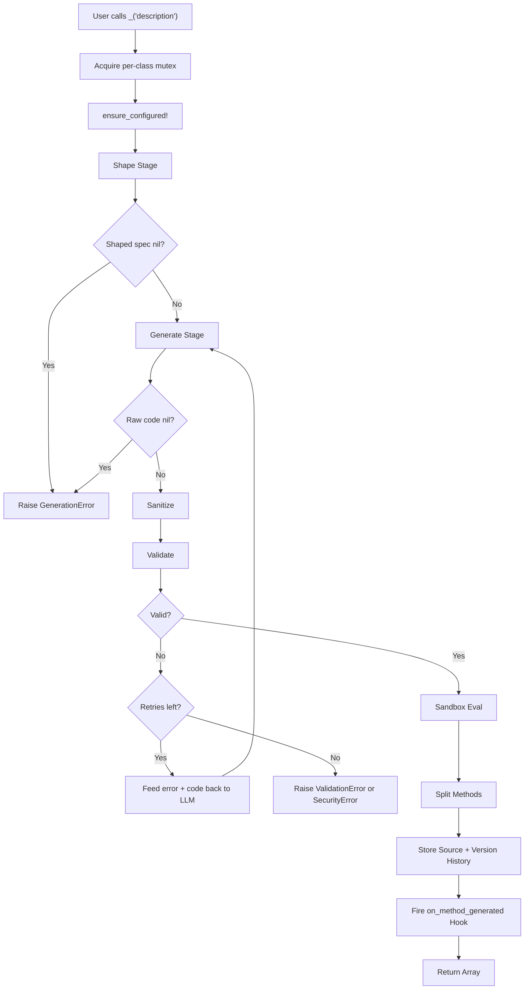
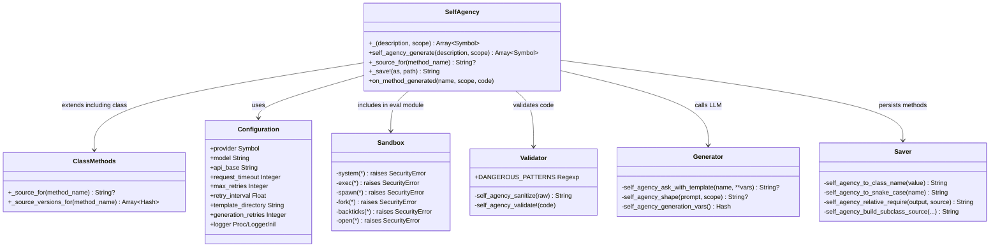

# Architecture Overview

SelfAgency uses a two-stage LLM pipeline with multi-layer security to generate and install methods at runtime.

## Pipeline



## Stage 1: Shape

The shape stage rewrites a casual language description into a precise Ruby method specification. It uses ERB templates from the `shape/` directory.

The LLM receives class context:

- **Class name** -- e.g., `Calculator`
- **Instance variables** -- e.g., `@data, @name`
- **Public methods** -- e.g., `add, subtract, mean`
- **Scope instruction** -- e.g., "This will be an instance method available on all instances of the class."

The shape stage does **not** produce code. It produces a refined natural language specification that the generate stage can work with reliably.

## Stage 2: Generate

The generate stage takes the shaped specification and produces a `def...end` block. It uses templates from the `generate/` directory.

The LLM receives the same class context plus the shaped specification from stage 1.

If validation or security checks fail, the generate stage retries up to `generation_retries` times (default: 3). On each retry, the previous error message and failed code are injected into the generate template via `previous_error` and `previous_code` variables, allowing the LLM to self-correct.

## Post-Processing

After generation, the raw LLM output goes through three steps:

### Sanitize

Strips artifacts from the LLM response:

- Markdown code fences (` ```ruby ... ``` `)
- `<think>` blocks (used by some models for chain-of-thought reasoning)
- Leading/trailing whitespace

### Validate

Four checks run in sequence:

1. **Non-empty** -- Code must not be blank
2. **Structure** -- Must contain at least one `def...end` block
3. **Security** -- Must not match any `DANGEROUS_PATTERNS`
4. **Syntax** -- Must compile via `RubyVM::InstructionSequence.compile`

### Sandbox Eval

The validated code is evaluated inside a sandboxed module that includes `SelfAgency::Sandbox`. This module shadows dangerous Kernel methods, placing them ahead of Kernel in Ruby's method resolution order (MRO).

Sandbox modules are **cached per scope** to prevent ancestor chain accumulation across multiple `_()` calls:

| Scope | Prepend Target | Cache Level |
|-------|---------------|-------------|
| `:instance` | `self.class` | Per class |
| `:singleton` | `singleton_class` | Per instance |
| `:class` | `self.class.singleton_class` | Per class |

On the first `_()` call for a given scope, a new anonymous module is created, prepended, and cached. Subsequent calls reuse the same module, defining new methods into it rather than creating additional anonymous modules.

## Module Structure



## Thread Safety

SelfAgency uses two mutexes to ensure thread-safe operation:

- **`CONFIG_MUTEX`** (module-level) -- Serializes `SelfAgency.configure` and `SelfAgency.reset!` calls so that concurrent configuration changes do not interleave.
- **Per-class mutex** (`@self_agency_mutex`) -- Initialized when a class includes `SelfAgency`. Serializes the entire `_()` pipeline per class so that concurrent method generation calls do not interfere with each other.

The per-class mutex wraps the full pipeline: shape, generate, validate (with retries), eval, source storage, and lifecycle hook. This means only one thread can generate methods for a given class at a time, but different classes can generate concurrently.

## File Layout

```
lib/
  self_agency.rb            # Main module, public API, eval logic
  self_agency/
    version.rb              # VERSION constant
    errors.rb               # Error hierarchy
    configuration.rb        # Configuration class and singleton methods
    sandbox.rb              # Runtime sandbox module
    validator.rb            # DANGEROUS_PATTERNS, sanitize, validate!
    generator.rb            # LLM communication and prompt shaping
    saver.rb                # _save! helpers
    prompts/
      shape/
        system.txt.erb      # Shape stage system prompt
        user.txt.erb        # Shape stage user prompt
      generate/
        system.txt.erb      # Generate stage system prompt
        user.txt.erb        # Generate stage user prompt
```
