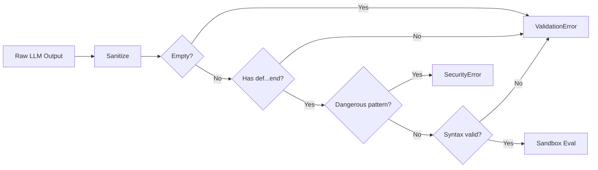

# Security

SelfAgency employs a two-layer security model to prevent generated code from performing dangerous operations. Both layers must pass before any code is installed.

## Layer 1: Static Analysis

Before code is evaluated, it is checked against `DANGEROUS_PATTERNS`, a compiled regular expression that matches known dangerous constructs:

| Pattern | What It Catches |
|---------|----------------|
| `\b(system\|exec\|spawn\|fork\|abort\|exit)\b` | Process execution and termination |
| `` `[^`]*` `` | Backtick shell execution |
| `%x\{`, `%x\[`, `%x\(` | `%x` shell execution syntax |
| `\bFile\.\b` | File system access |
| `\bIO\.\b` | I/O operations |
| `\bKernel\.\b` | Direct Kernel calls |
| `\bOpen3\.\b` | Advanced process spawning |
| `\bProcess\.\b` | Process management |
| `\brequire\b` | Loading external code |
| `\bload\b` | Loading external code |
| `\b__send__\b` | Method dispatch bypass |
| `\beval\b` | Dynamic code evaluation |
| `\bsend\b` | Method dispatch (`send`) |
| `\bpublic_send\b` | Method dispatch (`public_send`) |
| `\bmethod\s*\(` | Method object retrieval |
| `\bconst_get\b` | Constant lookup bypass |
| `\bclass_eval\b` | Class-level eval |
| `\bmodule_eval\b` | Module-level eval |
| `\binstance_eval\b` | Instance-level eval |
| `\binstance_variable_set\b` | Direct ivar write |
| `\binstance_variable_get\b` | Direct ivar read |
| `\bdefine_method\b` | Dynamic method definition |
| `\bBinding\b` | Binding access |
| `\bBasicObject\b` | BasicObject escape hatch |
| `\bremove_method\b` | Method removal |
| `\bundef_method\b` | Method undefinition |

If any pattern matches, a `SelfAgency::SecurityError` is raised and the code is **not evaluated**.

```ruby
# These all raise SelfAgency::SecurityError:
"def hack\n  system('ls')\nend"
"def hack\n  File.read('/etc/passwd')\nend"
"def hack\n  eval('1+1')\nend"
"def hack\n  require 'socket'\nend"
```

## Layer 2: Runtime Sandbox

Even if static analysis were bypassed, the runtime sandbox provides a second line of defense. Every generated method is evaluated inside an anonymous module that includes `SelfAgency::Sandbox`:

```ruby
module SelfAgency::Sandbox
  private

  def system(*)  = raise(::SecurityError, "system() blocked by SelfAgency sandbox")
  def exec(*)    = raise(::SecurityError, "exec() blocked by SelfAgency sandbox")
  def spawn(*)   = raise(::SecurityError, "spawn() blocked by SelfAgency sandbox")
  def fork(*)    = raise(::SecurityError, "fork() blocked by SelfAgency sandbox")
  def `(*)       = raise(::SecurityError, "backtick execution blocked by SelfAgency sandbox")
  def open(*)    = raise(::SecurityError, "open() blocked by SelfAgency sandbox")
end
```

Because the sandbox module is included in the anonymous module that wraps the generated code, its methods appear **ahead of Kernel** in Ruby's method resolution order (MRO). Any call to `system`, `exec`, `spawn`, `fork`, backticks, or `open` from within a generated method raises `::SecurityError` at runtime.

## Validation Pipeline

The full validation sequence runs in order. The first failure stops evaluation:



1. **Sanitize** -- Strip markdown fences, `<think>` blocks, whitespace
2. **Empty check** -- Raise `ValidationError` if code is blank
3. **Structure check** -- Raise `ValidationError` if no `def...end` block found
4. **Pattern check** -- Raise `SecurityError` if `DANGEROUS_PATTERNS` matches
5. **Syntax check** -- Raise `ValidationError` if `RubyVM::InstructionSequence.compile` fails
6. **Sandbox eval** -- Evaluate inside sandboxed anonymous module

## Limitations

The security model is designed for defense-in-depth against accidental or LLM-hallucinated dangerous code. It is **not** a full sandboxing solution:

- Static patterns can potentially be bypassed through creative obfuscation
- The runtime sandbox only shadows six specific Kernel methods
- Generated code has access to the full Ruby standard library (except blocked methods)
- Network access (e.g., `Net::HTTP`) is not blocked by default

For production use, consider additional controls such as network-level restrictions, process isolation, or reviewing generated code before deployment (see [`_save!`](../guide/saving-methods.md)).
