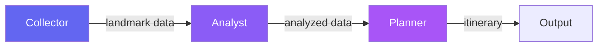
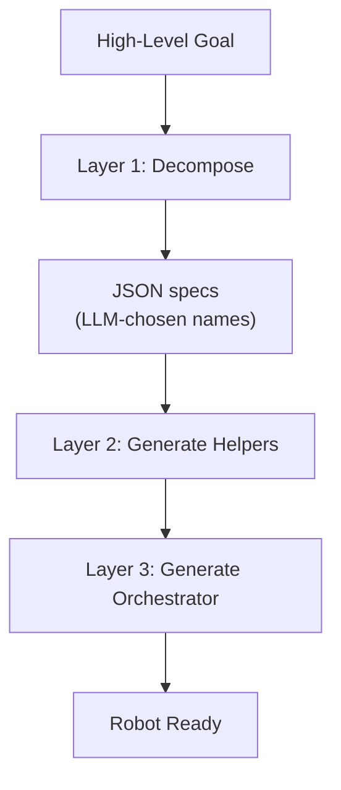

# Example 12: Autonomous Robots

Three robots autonomously build a city landmarks tour pipeline. Unlike Example 11, each robot receives only a high-level **goal** -- the LLM decides method names, algorithms, and data structures.

**Source:** `examples/12_autonomous_robots/`

## Architecture



| Robot | Goal | Methods |
|-------|------|---------|
| **Collector** | Return an Array of 8 fictional city landmarks | LLM decides |
| **Analyst** | Analyze landmark data (statistics, ranking, grouping) | LLM decides |
| **Planner** | Create a formatted one-day tour itinerary | LLM decides |

## Three-Layer LLM Approach

This example adds a third layer compared to Example 11:

1. **Layer 1 (Decompose):** Ask the LLM to break a high-level goal into helper method specs. The LLM chooses method names, parameters, and algorithms
2. **Layer 2 (Generate Helpers):** Loop through specs, call `_()` for each. SelfAgency handles shape, generate, validate, sandbox eval
3. **Layer 3 (Generate Orchestrator):** A final `_()` call generates an `execute_task` method that wires the helpers together



## Self-Repair

If `execute_task` raises at runtime, the robot attempts self-repair:

1. **Identify the failing method** from the backtrace
2. **Build a repair prompt** with the error, current source, goal context, and input data shape
3. **Regenerate** the failing method via `_()` with `scope: :singleton`
4. **Retry** (up to `MAX_REPAIR_ATTEMPTS = 3`)

```ruby
def perform_task(input = nil)
  attempts = 0

  begin
    execute_task(input)
  rescue => error
    attempts += 1
    if attempts < MAX_REPAIR_ATTEMPTS
      repair_method(error, input)
      retry
    end
  end
end
```

The repair prompt includes:

- The robot's overall goal
- All generated capabilities
- The current source code of the failing method
- The runtime error (class, message, backtrace)
- A description of the input data shape (class, keys, sample elements)

## Key Differences from Example 11

| Aspect | Example 11 (Collaborative) | Example 12 (Autonomous) |
|--------|---------------------------|------------------------|
| Task description | Prescriptive (exact method names, algorithms) | Goal-oriented (what, not how) |
| LLM layers | 2 (analyze + generate) | 3 (decompose + generate + orchestrate) |
| Method naming | Dictated by user | Chosen by LLM |
| Error recovery | None | Self-repair with retry |
| Scope | Instance methods | Singleton methods |

## Pipeline Execution

```ruby
# Step 1: Collector builds a landmark catalog
collector_result = collector.perform_task

# Step 2: Analyst processes the catalog
analyst_result = analyst.perform_task(analyst_input)

# Step 3: Planner creates the itinerary
final_itinerary = planner.perform_task(planner_input)
```

## Saving Robots

Each robot's generated methods are saved as a subclass:

```ruby
[collector, analyst, planner].each do |robot|
  path = robot._save!(as: robot.name)
end
```

This captures the LLM's autonomous design decisions as permanent Ruby source files.
