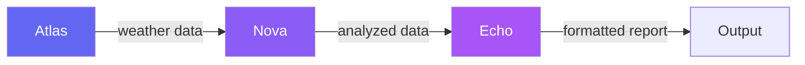

# Example 11: Collaborative Robots

Three robots collaborate through a shared message bus to build a weather data pipeline. Each robot's methods are generated by the LLM based on detailed task descriptions.

**Source:** `examples/11_collaborative_robots/`

## Architecture



Three robots connected by a `MessageBus`:

| Robot | Role | Methods Generated |
|-------|------|-------------------|
| **Atlas** | Data generator | `generate_weather_data`, `summarize_raw_data` |
| **Nova** | Analyzer | `compute_basic_statistics`, `classify_conditions` |
| **Echo** | Reporter | `format_weather_report` |

## Two-Layer LLM Approach

This example uses a **two-layer** approach:

1. **Layer 1 (Analyze):** A direct `RubyLLM.chat().ask()` call decomposes the task description into a JSON array of method specifications
2. **Layer 2 (Generate):** Loops through the specs and calls `_()` for each one. SelfAgency handles shape, generate, validate, and sandbox eval

The task descriptions are **prescriptive** -- they dictate exact method names, parameters, algorithms, and data structures.

## Robot Class

The `Robot` class includes `SelfAgency` and adds:

- **Task decomposition** via `analyze_task` -- asks the LLM to parse a task into method specs
- **Pipeline execution** via `execute` -- chains generated methods by arity
- **Message bus** -- `send_message`, `receive_message`, `broadcast`
- **Generation logging** via `on_method_generated`
- **Persistence** via `_save!` -- saves each robot as a subclass

```ruby
class Robot
  include SelfAgency

  attr_reader :name, :task, :bus, :inbox, :capabilities, :generation_log

  def initialize(name:, task:, bus:)
    @name = name
    @task = task
    @bus  = bus
    # ... decompose task, generate methods
  end

  def execute(input = nil)
    # Chain capabilities by arity
  end
end
```

## Pipeline Execution

```ruby
# Step 1: Atlas generates weather data
atlas_result = atlas.execute
atlas.send_message(to: "Nova", content: atlas_result)

# Step 2: Nova analyzes the data
nova_input = nova.inbox.last&.dig(:content)
nova_result = nova.execute(nova_input)
nova.send_message(to: "Echo", content: nova_result)

# Step 3: Echo formats the report
echo_input = echo.inbox.last&.dig(:content)
final_report = echo.execute(echo_input)
```

## Saving Robots

After the pipeline runs, each robot's generated methods are saved as a subclass file:

```ruby
[atlas, nova, echo].each do |robot|
  path = robot._save!(as: robot.name)
  puts "#{robot.name}: saved to #{path}"
end
```

This produces files like `atlas.rb`, `nova.rb`, `echo.rb`, each containing a `Robot` subclass with the generated methods baked in.

## Key Difference from Example 12

In this example, the task descriptions **dictate** method names and algorithms. The LLM is told *exactly* what to implement. Compare with [Example 12: Autonomous Robots](autonomous-robots.md), where robots receive only a high-level goal and the LLM decides everything.
