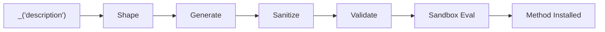

> [!CAUTION]
> This is an experiment. It may not be fit for any specific purpose.

# SelfAgency

<table>
  <tr>
    <td width="50%" valign="top">
      
    </td>
    <td width="50%" valign="top">
      <h3>Key Features</h3>
      <ul>
        <li><strong>Natural language to Ruby methods</strong> — describe what you want, get working code</li>
        <li><strong>Multiple methods at once</strong> — generate related methods in a single call</li>
        <li><strong>Three scopes</strong> — instance, singleton, and class methods</li>
        <li><strong>Two-stage LLM pipeline</strong> — shape the prompt, then generate code</li>
        <li><strong>Security by default</strong> — static analysis + runtime sandbox</li>
        <li><strong>Source inspection</strong> — view generated code with <code>_source_for</code></li>
        <li><strong>Save to files</strong> — persist as subclasses with <code>_save!</code></li>
        <li><strong>Provider agnostic</strong> — any LLM via <a href="https://github.com/crmne/ruby_llm">ruby_llm</a></li>
      </ul>
    </td>
  </tr>
</table>

Describe what you want in plain English, get working methods back. SelfAgency is a mixin module that gives any Ruby class the ability to generate and install methods at runtime via an LLM.

## Quick Example

```ruby
require "self_agency"

SelfAgency.configure do |config|
  config.provider = :ollama
  config.model    = "qwen3-coder:30b"
  config.api_base = "http://localhost:11434/v1"
end

class Calculator
  include SelfAgency
end

calc = Calculator.new
calc._("an instance method to add two integers, return the result")
#=> [:add]

calc.add(3, 7)
#=> 10
```

## Features

- **Natural language method generation** -- Describe methods in plain English, get working Ruby code
- **Multiple methods at once** -- Generate several related methods in a single call
- **Three scopes** -- Instance, singleton, and class methods
- **Two-stage LLM pipeline** -- Shape (refine the prompt) then Generate (produce code)
- **Security by default** -- Static analysis rejects dangerous patterns; runtime sandbox blocks system calls
- **Source inspection** -- View generated source code with `_source_for`
- **Persistence** -- Save generated methods as subclass files with `_save!`
- **Lifecycle hooks** -- Override `on_method_generated` to log or persist each method
- **Customizable prompts** -- ERB templates for both pipeline stages
- **Provider agnostic** -- Uses [ruby_llm](https://github.com/crmne/ruby_llm) to support any LLM provider

## How It Works



1. **Shape** -- Rewrites your casual English into a precise Ruby method specification
2. **Generate** -- Produces `def...end` blocks from the shaped spec
3. **Sanitize** -- Strips markdown fences and `<think>` blocks
4. **Validate** -- Checks for empty code, missing `def...end`, syntax errors, and dangerous patterns
5. **Sandbox Eval** -- Evaluates code inside an anonymous module that shadows dangerous Kernel methods

## Requirements

- Ruby >= 3.2.0
- An LLM provider (Ollama by default, or any provider supported by ruby_llm)

## Getting Started

Head to the [Installation](getting-started/installation.md) guide to add SelfAgency to your project, then follow the [Quick Start](getting-started/quick-start.md) for a complete walkthrough.
